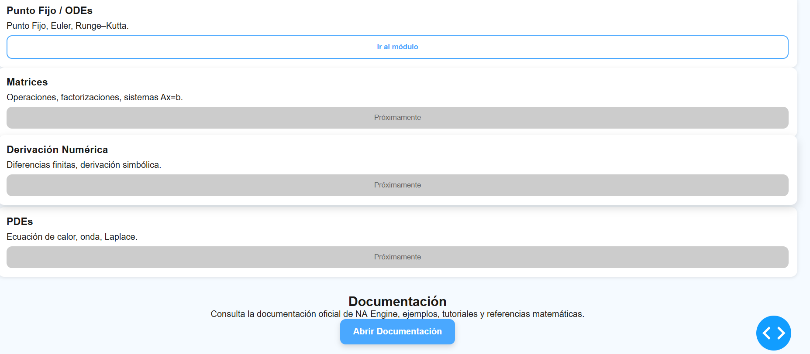

---

# 📘 **README v1.2 — NA‑Engine (Python 3.12, MIT License)**

# NA‑Engine
NA‑Engine is a modular, extensible, and interactive engine for solving Numerical Methods, Numerical Analysis, and Differential Equations problems.  
Built with Python **3.12** and powered by Dash, it provides automated computations, mathematical rendering, and structured outputs for academic, scientific, and engineering use.

---

## 🚀 Features

- Interactive Dash web application
- Numerical Methods:
  - Interpolation (Newton, Lagrange, Splines)
  - Numerical Integration (Simpson, Trapezoidal)
  - Differential Equations (Euler, Runge–Kutta, Systems)
- Markdown‑based mathematical output
- Modular OOP architecture for numerical algorithms
- Ready for unit testing with `pytest`
- Clean separation between UI, callbacks, and computation logic
- Expandable structure for new numerical methods and solvers

---

## 📁 Repository Structure

```
NA-Engine/
│
├── app/                         # Dash application
│   ├── __init__.py
│   ├── app.py                   # Dash initialization
│   ├── layout/                  # UI components
│   │   ├── base_layout.py       # Base layout that includes Header - Navigator - Main Content Frames
│   │   ├── home_layout.py       # Frames that route to the modules as part of the Main Content Frame
│   │   ├── interpolation_layout.py # Layout for the Interpolation module
│   │   ├── integration_layout.py # Layout for the Numerical Integration module
│   │   ├── navigation_layout.py  # Navigation layout definition
│   │   ├── ...
│   │   └── ode_layout.py         # Layout for the ODE module
│   │
│   ├── callbacks/               # Dash callbacks
│   │   ├── integration_callbacks.py  # Callbacks that generate output for Integration Section
│   │   ├── interpolation_callbacks.py # Callbacks that generate output for Interpolation Section
│   │   ├── navigation_callbacks.py # Callbacks that help navigate through the app
│   │   ├── ode_callbacks.py        # Callbacks that generate output for ODE Section
│   │   └── theme_callbacks.py      # Callbacks that manage dark/light themes
│   │
│   └── assets/                  # CSS, images, static files
│       ├── base.css             # resets, typography, variables
│       ├── components.css       # buttons, cards, inputs
│       ├── dark.css             # dark theme colors
│       ├── hero2.png            # Original asset generated by AI, included solely for educational and project documentation purposes
│       ├── layout.css           # layout structure
│       ├── puma3.png            # Original asset generated by AI, included solely for educational and project documentation purposes
│       ├── puma4.png            # Original asset generated by AI, included solely for educational and project documentation purposes
│       ├── responsive.css       # mobile and tablet visualization
│       └── theme.css            # light theme colors
│
├── core/                        # Numerical computation engine
│   ├── __init__.py
│   ├── base_method.py           # Abstract class for numerical methods
│   │
│   ├── interpolation/
│   │   ├── newton.py
│   │   ├── lagrange.py
│   │   └── splines.py
│   │
│   ├── integration/
│   │   ├── simpson.py
│   │   └── trapezoidal.py
│   │
│   └── ode/
│       ├── euler.py
│       ├── runge_kutta.py
│       └── systems.py
│
├── tests/                       # Unit tests (pytest)
│   ├── test_interpolation.py
│   ├── test_integration.py
│   └── test_ode.py
│
├── examples/                    # Example datasets (CSV/Excel)
│
├── requirements.txt
├── run.py                       # Entry point to run the Dash app
└── README.md
```

---

## ▶️ Running the Application

### **1. Install dependencies (Python 3.12)**

```
pip install -r requirements.txt
```

### **2. Start the application**

```
python run.py
```

The app will start locally and provide a URL such as:

```
`http://127.0.0.1:8050/`
```

Open it in your browser to use NA‑Engine.

---

## 🖼️ Screenshots

Below are previews of the NA‑Engine interface in both **light** and **dark** themes.

### 🌞 Light Theme

<p align="center">
  
</p>


### 🌙 Dark Theme


---

### 📌 Notes


---

## 🧠 Architecture Overview

NA‑Engine follows a clean, scalable architecture:

### **Dash UI Layer**
Layouts and callbacks separated by module for clarity and maintainability.

### **Core Numerical Engine**
Each numerical method is implemented as a class inheriting from `NumericalMethod`, enabling:

- Polymorphism  
- Reusability  
- Testability  
- Extensibility  

### **Testing Layer**
`pytest`‑based unit tests ensure correctness and prevent regressions as the engine grows.

---

## 🛣️ Roadmap

- [X] Improve UI/UX with custom CSS and components
- [ ] Add Hermite and Barycentric interpolation
- [ ] Add advanced ODE solvers (RK45, Adams–Bashforth)
- [ ] Add PDE solvers (Heat, Wave, Laplace)
- [ ] Add symbolic support (SymPy)
- [ ] Add CI/CD pipeline (GitLab or GitHub Actions)
- [ ] Add Docker support
- [ ] Add Django backend integration


---

## 📜 License — MIT

This project is licensed under the **MIT License**, allowing free use, modification, and distribution with attribution.

---

## ✨ Author

Developed by **Axel Espinosa M. Sc.**


---

