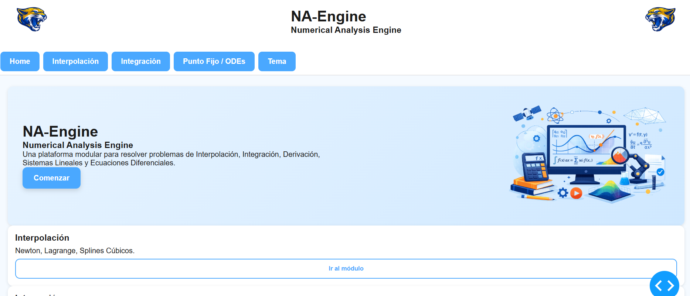
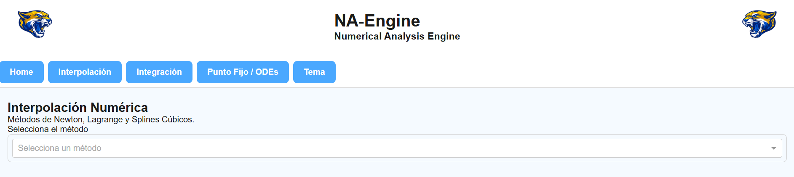
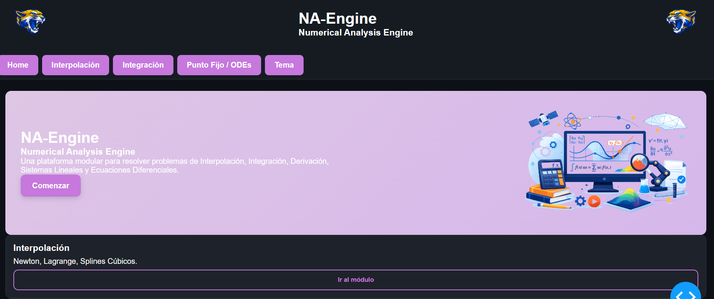
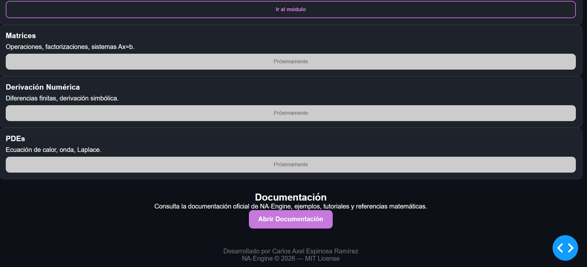
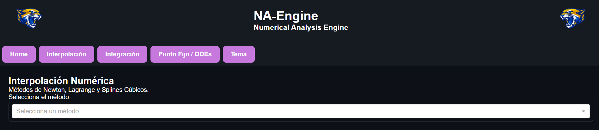
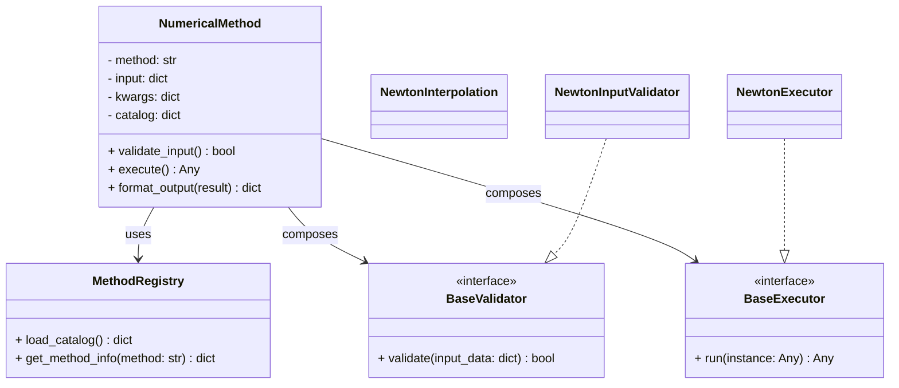

<p align="center">

  
  
  
  
  
  
  

</p>

---

# 📘 **README v1.2 — NA‑Engine (Python 3.12, MIT License)**

# NA‑Engine
NA‑Engine is a modular, extensible, and interactive engine for solving Numerical Methods, Numerical Analysis, and Differential Equations problems.  
Built with Python **3.12** and powered by Dash, it provides automated computations, mathematical rendering, and structured outputs for academic, scientific, and engineering use.

---

## 🚀 Features

- Interactive Dash web application
- Numerical Methods:
  - Interpolation (Newton, Lagrange, Splines)
  - Numerical Integration (Simpson, Trapezoidal)
  - Differential Equations (Euler, Runge–Kutta, Systems)
- Markdown‑based mathematical output
- Modular OOP architecture for numerical algorithms
- Ready for unit testing with `pytest`
- Clean separation between UI, callbacks, and computation logic
- Expandable structure for new numerical methods and solvers

---

## 📁 Repository Structure

```
NA-Engine/
│
├── app/                         
│   ├── __init__.py
│   ├── app.py                   
│   ├── layout/                  
│   │   ├── base_layout.py
│   │   ├── home_layout.py
│   │   ├── interpolation_layout.py
│   │   ├── integration_layout.py
│   │   ├── navigation_layout.py
│   │   └── ode_layout.py
│   │
│   ├── callbacks/               
│   │   ├── integration_callbacks.py
│   │   ├── interpolation_callbacks.py
│   │   ├── navigation_callbacks.py
│   │   ├── ode_callbacks.py
│   │   └── theme_callbacks.py
│   │
│   └── assets/                  
│       ├── base.css
│       ├── components.css
│       ├── dark.css
│       ├── layout.css
│       ├── responsive.css
│       ├── theme.css
│       ├── hero2.png
│       ├── puma3.png
│       └── puma4.png
│
├── core/                        
│   ├── __init__.py
│   ├── base_method.py           
│   ├── registry.py              # <-- JSON catalog loader
│   ├── exceptions.py            # <-- Fine Exceptions
│   ├── method_catalog.json      # <-- Method catalog
│   │
│   ├── interpolation/
│   │   ├── newton.py
│   │   ├── lagrange.py
│   │   └── splines.py
│   │
│   ├── integration/
│   │   ├── simpson.py
│   │   └── trapezoidal.py
│   │
│   └── ode/
│       ├── euler.py
│       ├── runge_kutta.py
│       └── systems.py
│
├── strategies/                  # <-- NUEVO: validators, executors, formatters
│   ├── __init__.py
│   ├── validators/
│   │   ├── __init__.py
│   │   ├── interpolation_validators.py # This file will encapsulate the validation for all interpolation methods unless there are specific conditions to split
│   │   ├── integration_validators.py
│   │   └── ode_validators.py
│   │
│   ├── executors/
│   │   ├── __init__.py
│   │   ├── lagrange_executors.py
│   │   ├── newton_executors.py
│   │   ├── integration_executors.py # TBD
│   │   └── ode_executors.py # TBD
│   │
│   └── formatters/
│       ├── __init__.py
│       └── table_formatter.py
│
├── tests/                       
│   ├── test_interpolation.py
│   ├── test_integration.py
│   └── test_ode.py
│
├── examples/                    
│
├── requirements.txt
├── run.py                       
└── README.md

```

---

## ▶️ Running the Application

### **1. Install dependencies (Python 3.12)**

```
pip install -r requirements.txt
```

### **2. Start the application**

```
python run.py
```

The app will start locally and provide a URL such as:

```
`http://127.0.0.1:8050/`
```

Open it in your browser to use NA‑Engine.

---

## 🖼️ Screenshots

Below are previews of the NA‑Engine interface in both **light** and **dark** themes.

### 🌞 Light Theme

<p align="center">
  
</p>

<p align="center">
  
</p>


<p align="center">
  
</p>


### 🌙 Dark Theme

<p align="center">
  
</p>

<p align="center">
  
</p>


<p align="center">
  
</p>

---

## Core Calculator UML Diagram


---

## Unit Testing

```
python -m pytest -q
```

Will execute all scripts inside the tests folder that matches the following conventions:

- Filename like `test_*.py` or `*_test.py`
- Functions inside are named `test_*`
- Classes inside are named `Test*` and must not have `__init__` function

If we only want to execute a single file we perform

```
python tests\test_<method-name>.py -q
```

And furthermore, if we want only to execute a single test we perform

```
python tests\test_<method-name>.py::test_<test-name> -q
```

If we want to skip one file, either we change the name of the file or write the following code at the beginning

```python
pytestmark = pytest.mark.skip("Work in progress")
```

---

### 📌 Notes


---

## 🧠 Architecture Overview

NA‑Engine follows a clean, scalable architecture:

### **Dash UI Layer**
Layouts and callbacks separated by module for clarity and maintainability.

### **Core Numerical Engine**
Each numerical method is implemented as a class inheriting from `NumericalMethod`, enabling:

- Polymorphism  
- Reusability  
- Testability  
- Extensibility  

### **Testing Layer**
`pytest`‑based unit tests ensure correctness and prevent regressions as the engine grows.

---

## 🛣️ Roadmap

- [X] Improve UI/UX with custom CSS and components
- [ ] Add Hermite and Barycentric interpolation
- [ ] Add advanced ODE solvers (RK45, Adams–Bashforth)
- [ ] Add PDE solvers (Heat, Wave, Laplace)
- [ ] Add symbolic support (SymPy)
- [ ] Add CI/CD pipeline (GitLab or GitHub Actions)
- [ ] Add Docker support
- [ ] Add Django backend integration


---

## 📜 License — MIT

This project is licensed under the **MIT License**, allowing free use, modification, and distribution with attribution.

---

## ✨ Author

Developed by **Axel Espinosa M. Sc.**


---

