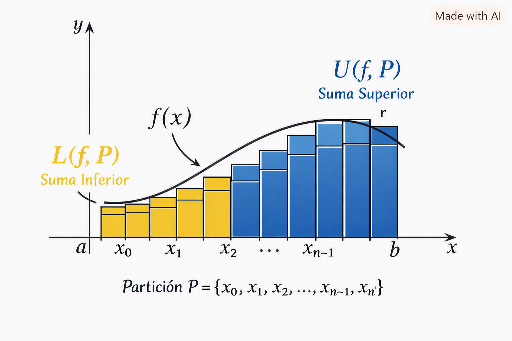

---

# Clenshaw-Curtis Quadrature — Theory

Clenshaw-Curtis is a method for numerical integration which is based on an expansion of the integrand in terms of Chebyshev polynomials.

# **Table of Contents**

- [Overview](#overview)
- [Chebyshev Polinomials](#chebyshev-polynomials)
- [Clenshaw-Curtis Quadrature](#clenshaw-curtis-quadrature)
- [Example](#example)
- [Sources](#sources)

# **Overview**

Let $f$ a function over an interval $[a, b] \in \mathbb{R}$, let's say $f$ is integrable. Our goal is to find a way to find the value of the integral of this function using a numerical way instead of analytic such as the methods that have been adapted in this tool.

To do that we need to relay on the integral definition which is the sum of the cover made of rectangles under the curve, as we may know by *Haaser, et al*

$$
L(f,P) \leq \int_{a}^{b} f(x)dx \leq U(f,P)
$$

where $L(f,P)$ are the lower sums for a partition $P$ of length $n$ and $U(f,P)$ are the upper sums.

  

In other words, an integral is the sum of the areas of a succesion of rectangles that cover the range of the function.

Now, by the condition we set up above, both, the lower and upper sums hold a gap with the actual value for the integral, since we have to calculate it numerically, we must apply a change of variable to converge to the solution. *Clenshaw-Curtis* bases its calculation in the substitution $x=\cos{(\theta)}$ and thus, giving us nodes in the form of the *Chebyshev polinomials*.

# **Chebyshev polynomials**

Since we applied the substitution $x=\cos{(\theta)}$, we must note that the integration interval will be parametrized in $[-1, 1]$, moreover $\theta\in [0, \pi]$.

Given this, let's define the first type Chebyshev polynomials by $T_{n}(\cos{(\theta)})=\cos{(k\theta)}$ which nodes hold a recurrence relationship such as:

$$
\begin{align}
T_{0}(\cos{(\theta)})=1  \\
T_{1}(\cos{(\theta)})=\cos{(\theta)} = x  \\
T_{2}(\cos{(\theta)})=\cos{(2\theta)}\equiv \cos{(\theta)}^{2} - \sin{(\theta)}^{2} = \cos{(\theta)}^{2} - (1-\cos{(\theta)}^{2}) = 2\cos{(\theta)}^{2} - 1 \equiv 2x^2 -1  \\
T_{3}(\cos{(\theta)})=\cos{(3\theta)}\equiv \cos{(\theta)}^{3} - 3\cos{(\theta)}\sin{(\theta)}^{2} = \cos{(\theta)}(\cos{(\theta)}^{2}- 3\sin{(\theta)}^{2}) = \cos{(\theta)}(\cos{(\theta)}^{2}- 3(1-\cos{(\theta)}^{2})) = \cos{(\theta)}(\cos{(\theta)}^{2}- 3 + 3\cos{(\theta)}^{2}) = \cos{(\theta)}(4\cos{(\theta)}^{2}- 3) = 2\cos{(\theta)}(2\cos{(\theta)}^{2}-1) -\cos{(\theta)} = 2\cos{(\theta)}(2x^{2}-1) - x = 2\cos{(\theta)}T_{2}(\cos{(\theta)}) - T_{1}(\cos{(\theta)}) \\
\text{Y en general..}   \\
T_{n+1}(\cos{(\theta)}) = 2\cos{(\theta)}T_{n}(\cos{(\theta)}) - T_{n-1}(\cos{(\theta)})
\end{align}
$$

# **Clenshaw-Curtis Quadrature**

## **Problem Decomposition into cosines sums**

Let $n$ the number of subintervals of an interval $[a, b]$, following the definition of the Chebyshev polynomials, we set the substitution $x_{i}=\cos{(\frac{\pi i}{n})}$.

*Clenshaw-Curtis's* idea is to aproximate $f(x)$ using Chebyshev polinomials such as

$$
\begin{align}
f(x)=\sum_{k=0}^{n}a_{k}T_{k}(x)   \\
\equiv f(\cos{(\theta)})=\sum_{k=0}^{n}a_{k}\cos{(k\theta)}
\end{align}
$$

where the coefficients $a_k$ are gotten by adjusting this series to the values $f(x_i)$ in the nodes $x_i=\cos{(\theta_{i})}$. In other words, we are interpolating $f$ in Chebyshev nodes using a series of cosines.

So, going back to our initial issue, let $f$ an integrable function over an interval $[a, b]$, we want to calculate $\int_{a}^{b}f(x)dx$, since $x=\cos{(\theta)}$, then $dx = -\sin{(\theta)}d\theta$.

We must notice that to make this integral runs in $[a, b]$ and when we apply the variable change $\theta\in[0, \pi]$ to ensure this happen correctly, we need to reparametrize $x$ in terms of $\theta$, this means $x(t)=\frac{b-a}{2}t+\frac{a+b}{2}, t\in[-1,1]$, then, the integral has the following form:

$$
\begin{align}
I=\int_{a}^{b}f(x)dx=\frac{b-a}{2}\int_{-1}^{1}f(x(t))dt    \\
= \frac{b-a}{2}\int_{\pi}^{0}f(\cos{(\theta)})(-\sin{(\theta)})d\theta    \\
= \frac{b-a}{2}\int_{0}^{\pi}f(\cos{(\theta)})\sin{(\theta)}d\theta
\end{align}
$$

Without generality loss, let's focus on the $[-1, 1]$ interval, just need to remind that in the end we will add the $[a, b]$ factor.

As mentioned above, $f$ will be approximated with a finite series of cosine, which means:

$$
f(\cos{(\theta)})\approx \sum_{k=0}^{n}a_{k}\cos{(k\theta)}
$$

Then, we substitute the Chebyshev approximation from above in the integral

$$
\begin{align}
\Rightarrow \int_{0}^{\pi}\sum_{k=0}^{n}a_{k}\cos{(k\theta)}\sin{(\theta)}d\theta   \\
\text{Remembering that we are not using the interval factor due to we are focusing in the [-1,1] interval}  \\
\Rightarrow \sum_{k=0}^{n}a_{k}\int_{0}^{\pi}\cos{(k\theta)}\sin{(\theta)}d\theta   \\
\text{By sum properties}
\end{align}
$$

So, let's make $\beta_{k}=\int_{0}^{\pi}\cos{(k\theta)}\sin{(\theta)}d\theta$, then

$$
I\approx \sum_{k=0}^{n}a_{k}\beta_{k}
$$

To calculate $\beta_{k}$ we use the trigonometric identity $\cos{(k\theta)}\sin{(\theta)}=\frac{1}{2}[\sin{((k+1)\theta)}-\sin{((k-1)\theta)}]$. If we integrate that expression we have:

$$
\begin{align}
\beta_{k}=\frac{1}{2}\left(\frac{1-\cos{((k+1)\pi)}}{k+1}-\frac{1-\cos{((k-1)\pi)}}{k-1} \right)    \\
\end{align}
$$

since $k\in\mathbb{Z}$ and $\cos{(k\pi)} = (-1)^{k}, k\in\mathbb{Z}$ we have:

$$
\begin{align}
\beta_{k}= \frac{1}{2}\left(\frac{1-(-1)^{k+1}}{k+1}-\frac{1-(-1)^{k-1}}{k-1} \right) \\
= \frac{1}{2}\left(\frac{1-(-1)^{k+1}(k-1)+ 1-(-1)^{k-1}(k+1)}{k^{2}-1} \right) \\
= -\frac{1}{2}\left(\frac{4}{k^{2}-1} \right) \\
= \left(\frac{2}{1-k^{2}} \right)
\end{align}
$$

Notice that if $k$ is even, we get to the result from above, but if it is odd the initial expression is reduced to $0$, so given that only even values participate actively we use the reindexation $k=2m$ which gives us

$$
\begin{align}
\beta_{k}=\beta_{2m}= \left(\frac{2}{1-4k^{2}} \right)
\end{align}
$$

Therefore, the integral becomes:

$$
\int_{0}^{\pi}f(\cos{(\theta)})\sin{(\theta)}d\theta=a_{0}+\sum_{k=1}^{n}\frac{2a_{2k}}{1-4k^{2}}
$$

However, to calculate $a_{k}$ it is necessary to perform another numerical integration since it is defined by

$$
a_{k}=\frac{2}{\pi}\int_{0}^{\pi}f(\cos{(\theta)})\cos{(k\theta)}d\theta, k=0,1,2,...
$$

But this integral can be approximated by the Type I Discrete Fourier Transform (DCT)

$$
a_{k}\approx\frac{2}{N}\left[\frac{f(1)}{2}+\frac{f(-1)}{2}(-1)^{k}+\sum_{n=1}^{N-1}f(\cos{(\frac{n\pi}{N})})\cos{(\frac{nk\pi}{N})}\right], k=0,1,...,N
$$

Since we already saw that when $k$ is odd all values related to the $\cos{(k\pi)}$ function will be $0$, we will only be taking the even values of $k$ performing the reindexation that was shown above, and transforming the formula for $a_{k}$ to:

$$
a_{2k}\approx\frac{2}{N}\left[\frac{f(1)+f(-1)}{2}+f(0)(-1)^{k}+\sum_{n=1}^{N/2-1}\left[f(\cos{(\frac{n\pi}{N})})+f(-\cos{(\frac{n\pi}{N})})\right]\cos{(\frac{nk\pi}{N/2})}\right], k=0,1,...,N
$$

## **Matrix form**

Considering the initial problem $f(x_i)=f(\cos{(\theta_{i})})\approx\sum_{k=0}^{n}a_{k}\cos{(k\theta_{i})}$ has the matrix form.

$$
f\approx C\alpha
$$

where:

- $f=\left[f(x_0),f(x_1),...,f(x_n)\right]^{T}$
- $\alpha\left[a_0,a_1,...,a_n\right]^{T}$
- $C_{i,k}=\cos{(k\theta_{i})}$

where we can deduct that if $C$ is invertible, then

$$
\alpha\approx C^{-1}f
$$

From the problem definition we know that

$$
\begin{align}
I\approx\sum_{k=0}^{n}a_{k}\beta_{k}    \\
\Rightarrow I\approx\beta^{T}\alpha=\beta^{T}C^{-1}f
\end{align}
$$

Let's define $w^{T}=\beta^{T}C^{-1}$, then

$$
\begin{align}
I\approx w^{T}f=\sum_{i=0}^{n}w_{i}f(x_{i}) \\
\Rightarrow \int_{-1}^{1}f(x)dx\approx\sum_{i=0}^{n}w_{i}f(x_{i})
\end{align}
$$

$w_i$ can be calculated by the closed formula

$$
w_{i}=\frac{2}{n}\left[1-\sum_{k=1}^{[n/2]}\frac{2}{4k^2-1}\cos{(\frac{2\pi ki}{n})}\right]
$$

# Example

Let $f(x)=x^2$ over the interval $[2, 5]$ and let $n=4$, which makes $n+1=5$ Clenshaw-Curtis nodes.

Analitically:

$$
\begin{align}
\int_{2}^{5}x^{2}dx=\left[\frac{x^3}{3}\right]_{2}^{5} = \frac{125}{3}-\frac{8}{3}=\frac{117}{3}=39
\end{align}
$$

Let's reparametrize since we are doing a variable change, let's define:

$$
\begin{align}
x(t)=\frac{b-a}{2}t+\frac{a+b}{2}   \\
a=2 \wedge b=5  \\
x(t)=\frac{3}{2}t+\frac{7}{2}
\end{align}
$$

which means, the integral will become in

$$
\begin{align}
\int_{2}^{5}x^{2}dx=\frac{b-a}{2}\int_{-1}^{1}(x(t))^{2}dt=\frac{3}{2}\int_{-1}^{1}\left(\frac{3}{2}t+\frac{7}{2}\right)^{2}dt
\end{align}
$$

## **Step 1: Clenshaw-Curtis nodes in [-1,1]**

For $n=4$, $t_{i}=\cos{(\frac{\pi i}{4})}, i=\{0, 1, 2, 3, 4\}$

| $i$ | $\theta_i = \frac{\pi i}{4}$ | $t_i = \cos{(\theta_i)}$ |
| --- | --- | --- |
| 0 | $0$ | $1$ |
| 1 | $\pi/4$ | $\frac{\sqrt{2}}{2} \approx 0.7071$ |
| 2 | $\pi/2$ | $0$ |
| 3 | $3\pi/4$ | $-\frac{\sqrt{2}}{2} \approx -0.7071$ |
| 4 | $\pi$ | $-1$ |

## **Step 2: Clenshaw-Curtis weights in $[-1,1]$ for $n=4$**

For this we use the closed formula given by the Discrete Fourier Transform

$$
a_{k}\approx\frac{2}{N}\left[\frac{f_0}{2}+\frac{f_N}{2}(-1)^{k}+\sum_{n=1}^{N-1}f_{n}\cos{(\frac{nk\pi}{N})}\right]
$$

since $N=4$, we need $a_{0}$ and $a_{2}$

First we calculate $a_{0}$, since $k=0$, $\cos{(\frac{nk\pi}{N})}=1$, then

$$
\begin{align}
a_{0}\approx\frac{2}{4}\left[\frac{f_0}{2}+\frac{f_4}{2}(-1)^{k}+\sum_{n=1}^{3}f_{n}\right] \\
a_{0}\approx 26.75
\end{align}
$$

Then we will calculate $a_{2}$, so

$$
\begin{align}
a_{2}\approx\frac{2}{4}\left[\frac{f_0}{2}+\frac{f_4}{2}(-1)^{k}+\sum_{n=1}^{3}f_{n}\cos{(\frac{nk\pi}{4})}\right] \\
a_{2}\approx 1.125
\end{align}
$$

## **Step 3: Integrate from $[-1, 1]$**

Finally we use the formula

$$
I=\int_{-1}^{1}g(t)dt\approx a_{0}+\sum_{k=1}^{N/2}\frac{2a_{2k}}{1-(2k)^{2}}
$$

Where $g(t)=(x(t)^{2})$. Since $N=4$, $N/2=2$

$$
I\approx 26
$$

## **Step 4: Integrate from the original $[2,5]$**

Then, we return to our first integral

$$
\int_{2}^{5}x^{2}dx=\frac{3}{2}\int_{-1}^{1}g(t)dt\approx\frac{3}{2}26=39
$$

Which matches the analytical result.

# Sources

- Trefethen, Lloyd N. Is Gauss Quadrature Better than Clenshaw-Curtis?. Oxford. England. 2008. From: https://people.maths.ox.ac.uk/trefethen/publication/PDF/2008_127.pdf#:~:text=We%20compare%20the%20convergence%20behavior%20of%20Gauss%20quadrature,factor-of-2%20advantage%20of%20Gauss%20quadra-ture%20is%20rarely%20realized.
- Virginia Tech. Lecture 23: Clenshaw-Curtis Quadrature. USA. NA. From: https://personal.math.vt.edu/embree/math5466/lecture23.pdf
- Haaser, Norman B. Análisis Matemático Curso de Introducción. Trillas. México. 1992. From: https://ia803205.us.archive.org/31/items/analisismatematicoihassersullivan/Analisis%20matematico%20I%20Hasser%20Sullivan_text.pdf
