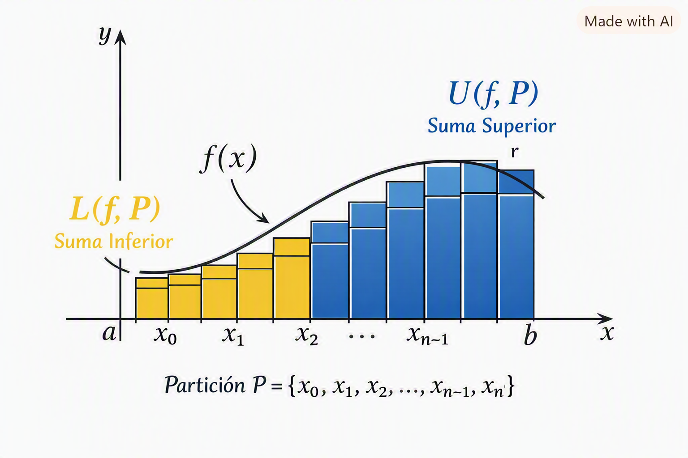

---

# Gauss–Legendre Quadrature — Theory

Gauss–Legendre quadrature is a high‑accuracy numerical integration method that evaluates the integrand at optimally chosen points.  

It achieves maximal precision for a given number of nodes by choosing both **nodes** and **weights** in a mathematically optimal way.

It is exact for all polynomials of degree $\le 2n - 1$

---

---

# **Table of Contents**

-   [Overview](#overview)
-   [Legendre Polinomials](#legendre-polynomials)
    -   [Definition via Differential Equations](#differential-equations-definition)
    -   [Orthogonality](#orthogonality)
    -   [Roots and Weights](#roots-and-weights)
-   [Interval Transformation](#interval-transformation)
-   [Gauss-Legendre Quadrature](#clenshaw-curtis-quadrature)
-   [Example](#example)
-   [Why is Gauss-Legendre Specially Powerfull](#why-gausslegendre-is-especially-powerful)
-   [Sources](#sources)

---

# Overview

Let $f$ a function over an interval $[a, b] \in \mathbb{R}$, let's say $f$ is integrable. Our goal is to find a way to find the value of the integral of this function using a numerical way instead of analytic such as the methods that have been adapted in this tool.

To do that we need to relay on the integral definition which is the sum of the cover made of rectangles under the curve, as we may know by *Haaser, et al*

$$
L(f,P) \leq \int_{a}^{b} f(x)dx \leq U(f,P)
$$

where $L(f,P)$ are the lower sums for a partition $P$ of length $n$ and $U(f,P)$ are the upper sums.

  

Gauss-Legendre Quadrature is a high accuracy numerical integration technique that addresses this problem. This method is designed to integrate over the $[-1, 1]$ interval, which means that for the original $[a, b]$ interval a variable change must be performed.

Gauss-Legendre uses weighting function $w_{i}(x)=\frac{2}{(1-x_{i}^{2})[P_{n}^{'}(x_{i})]^{2}}$ making that the quadrature will choose abscissas as the roots of the **Legendre Polynomials** $P_{n}(x)$ where $n$ is the order of the quadrature. These roots are symmetric about zero being equally weighted to its contribution to the integral.

---

# Legendre Polynomials

Gauss–Legendre quadrature is built on the **Legendre Polynomials** $P_n(x)$, a family of orthogonal polynomials on the interval $[-1, 1]$ with weight function 

$$
\begin{align}
w_{i}(x)=\frac{2}{(1-x_{i}^{2})[P_{n}^{'}(x_{i})]^{2}}
\end{align}
$$

## Differential Equations' Definition

Legendre polynomials satisfy the differential equation:

$$
\begin{align}
(1 - x^2)P_n'(x) - nxP_n(x) + nP_{n-1}(x) = 0
\end{align}
$$

and can be generated using Rodrigues’ formula:

$$
\begin{align}
P_n(x) = \frac{1}{2^n n!}\frac{d^n}{dx^n}\left[(x^2 - 1)^n\right]
\end{align}
$$

## Orthogonality

They are orthogonal on $[-1, 1]$:

$$
\int_{-1}^{1} P_m(x)P_n(x)\,dx = 0 \quad \text{for } m \ne n.
$$

This orthogonality is the key property that allows Gauss quadrature to achieve maximal accuracy.

## Roots and Weights

The **nodes** $t_i$ of Gauss–Legendre quadrature are the roots of $P_n(t)$:

$$
P_n(t_i) = 0.
$$

The **weights** are computed using:

$$
w_i = \frac{2}{(1 - t_i^2)[P_n'(t_i)]^2}.
$$

These nodes and weights guarantee exactness for polynomials up to degree $2n - 1$.

---

# Gauss-Legendre Quadrature

## Interval Transformation

Legendre nodes are defined on the canonical interval $[-1, 1]$. To integrate on a general interval $[a, b]$, each node is transformed as:

$$
x_i = \frac{b - a}{2}t_i + \frac{a + b}{2}.
$$

The integral becomes:

$$
\int_a^b f(x)\,dx \approx \frac{b - a}{2} \sum_{i=0}^{n-1} w_i f(x_i).
$$

This affine transformation preserves the optimality of the nodes.

---

# Properties

### Advantages
- Very high accuracy with few evaluation points  
- Exact for polynomials of degree up to $2n - 1$  
- Optimal node placement (no wasted evaluations)  
- Excellent for smooth functions

### Disadvantages
- Nodes and weights must be computed (not equally spaced)  
- Less effective for functions with singularities or discontinuities  
- More complex implementation compared to trapezoid or Simpson

---

# Example

For:

$$
f(x) = x^2,\quad [0, 2],\quad n = 2,
$$

Analytically we have that the integral gives us:

$$
\begin{align}
\int_{0}^{2}f(x)dx=\int_{0}^{2}x^{2}dx  \\
=\left[\frac{x^{3}}{3}\right]_{0}^{2}   \\
=\frac{8}{3}\approx 2.6666667
\end{align}
$$

Using **Gauss–Legendre quadrature** with $n = 2$ the **Legendre Polynomial** by Rodrigues's formula is:

$$
\begin{align}
P_2(t) = \frac{1}{2^{2} 2!}\frac{d^{2}}{dt^{2}}\left[(t^2 - 1)^2\right] \\
=\frac{1}{8}\frac{d}{dt}\left[2(t^{2}-1)(2t)\right] \\
=\frac{1}{8}\frac{d}{dt}\left[(4t^{3}-4t)\right] \\
=\frac{1}{8}\left[(12t^{2}-4)\right]    \\
=\frac{1}{2}(3t^2 - 1)
\end{align}
$$

Its roots (nodes) are:

$$
t_1 = -\frac{1}{\sqrt{3}}, \quad
t_2 = \frac{1}{\sqrt{3}}.
$$

The corresponding weights are:

$$
\begin{align}
w_{1}(t)=\frac{2}{(1-t_{1}^{2})[P_{2}^{'}(t_{1})]^{2}}  \\
=\frac{2}{(1+\frac{1}{3})(3)} = 1    \\ 
w_{2}(t)=\frac{2}{(1-t_{2}^{2})[P_{2}^{'}(t_{2})]^{2}}  \\
=\frac{2}{(1-\frac{1}{3}){3}} = 1
\end{align}
$$

We use the affine transformation:

$$
\begin{align}
x_i = \frac{b - a}{2}t_i + \frac{a + b}{2}, \quad [a, b] = [0, 2]
\end{align}
$$

So:

$$
\begin{align}
\frac{b - a}{2} = \frac{2 - 0}{2} = 1, \\
\frac{a + b}{2} = \frac{0 + 2}{2} = 1
\end{align}
$$

Then:

$$
\begin{align}
x_1 = 1 \cdot t_1 + 1 = 1 - \frac{1}{\sqrt{3}}, \\
x_2 = 1 \cdot t_2 + 1 = 1 + \frac{1}{\sqrt{3}}.
\end{align}
$$

Then we evaluate the integrand at the transformed nodes

$$
\begin{align}
f(x_1) = \left(1 - \frac{1}{\sqrt{3}}\right)^2, \\
f(x_2) = \left(1 + \frac{1}{\sqrt{3}}\right)^2
\end{align}
$$

We can expand:

$$
f(x_{1}) = \left(1 - \frac{1}{\sqrt{3}}\right)^2 = 1 - \frac{2}{\sqrt{3}} + \frac{1}{3},
$$

and

$$
f(x_2)\left(1 + \frac{1}{\sqrt{3}}\right)^2= 1 + \frac{2}{\sqrt{3}} + \frac{1}{3}
$$

Then we apply Gauss–Legendre formula on $[0, 2]$

The transformed quadrature rule is:

$$
\begin{align}
\int_0^2 f(x)\,dx \approx \frac{b - a}{2} \sum_{i=1}^{n} w_i f(x_i) \\
= 1 \cdot \left[f(x_1) + f(x_2)\right]
\end{align}
$$

So:

$$
\int_0^2 x^2\,dx\approx f(x_1) + f(x_2).
$$

Sum:

$$
\begin{align}
f(x_1) + f(x_2) = \left(1 - \frac{2}{\sqrt{3}} + \frac{1}{3}\right) + \left(1 + \frac{2}{\sqrt{3}} + \frac{1}{3}\right) \\
= 2 + \frac{2}{3}   \\
= \frac{8}{3}
\end{align}
$$

which **matches exactly** the analytical value.

---

# Why is Gauss–Legendre Specially Powerful

The true strength of Gauss–Legendre quadrature lies in its **polynomial optimality**:

### ✔ It is the most accurate possible quadrature rule for polynomials  
Given $n$ nodes, **no other quadrature rule** can integrate polynomials of degree up to $2n - 1$ exactly.

### ✔ It minimizes integration error for smooth functions  
Because smooth functions can be approximated by polynomials, Gauss–Legendre often achieves near‑machine precision with very few nodes.

### ✔ It outperforms composite rules dramatically  
Even Simpson’s rule (degree‑3 exactness) cannot match Gauss–Legendre’s degree‑$2n - 1$ exactness.

This makes Gauss–Legendre the preferred choice for:

- smooth integrands  
- high‑precision scientific computing  
- spectral methods  
- orthogonal polynomial expansions  

---

# Sources

- Legendre polynomials. Encyclopedia of Mathematics. URL: http://encyclopediaofmath.org/index.php?title=Legendre_polynomials&oldid=55061
- Burden, R. L., & Faires, J. D. (2001). Numerical Analysis (7th ed., pp. 220–226). Brooks/Cole.

---

# End of Document

---
