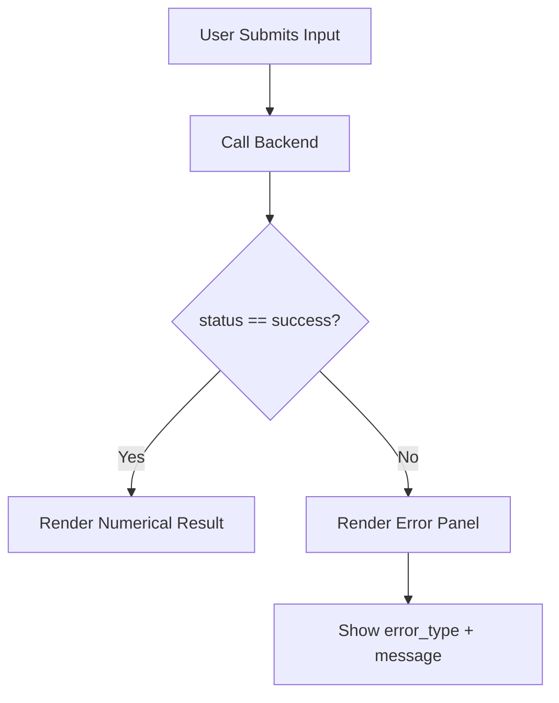

# 📘 **ui_layout_error_flow.md**

# UI Layout — Error Flow

## Introduction

This document describes how the UI should handle, interpret, and display errors returned by the backend through the Error Layer. Although the full UI implementation will be completed later in Stage 4, this document establishes the foundational rules for error rendering.

---

## Error Contract (Backend → UI)

The UI will always receive one of two structures:

### 1. Success Response

```json
{
  "status": "success",
  "result": { ... }
}
```

### 2. Error Response

```json
{
  "status": "error",
  "error_type": "ValidationError",
  "message": "x0 must be a real number.",
  "context": { ... }
}
```

---

## UI Responsibilities

### 1. Detect Error State

```js
if (response.status === "error") {
    renderError(response);
}
```

### 2. Display Error Type

- ValidationError → user input issue
- ExecutionError → numerical failure
- MathError → division by zero, overflow
- FunctionSyntaxError → malformed function
- FunctionNameError → unknown variable
- InternalError → unexpected backend issue

### 3. Display Message

The `message` field is always user‑friendly.

### 4. Optional: Show Context for Debugging

Useful for developer mode or logs.

---

## UI Error Flow Diagram



---

## Error Rendering Guidelines

- Use color coding (e.g., red for errors)
- Show the error type as a title
- Show the message as the main content
- Provide a “Try Again” or “Fix Input” action
- Avoid showing raw JSON unless in developer mode

---

## Summary

This document defines how the UI should interpret and display errors returned by the backend. It ensures consistency across modules and prepares the foundation for the full UI implementation in Stage 4.

---

